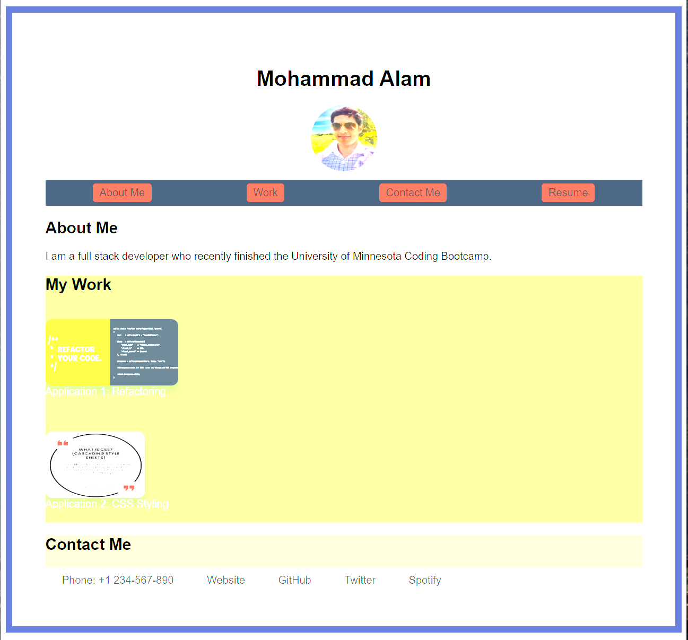

# This website shows my work experiance with some website examples

## Description

Please find a few sample website examples that I developed.

### Purpose

The primary goals of this wbsite is to showcase my work to potential employers:
1. **Enhance Accessibility**: Implementing semantic HTML ensures the content is more accessible, benefitting users with disabilities.
2. **SEO Optimization**: Semantic tags can lead to improved search engine rankings.
3. **Maintainability**: Semantic HTML makes the codebase easier to read and maintain.

### Changes Made

- Added project portfolio.
- Used semantic html elements.
- Introduced the `<figure>` element for better representation of images.

## Website 

### URL
https://alamm01.github.io/css_demo/

### Screenshot

## Conclusion

This website will be updated as new website projects are completed.
